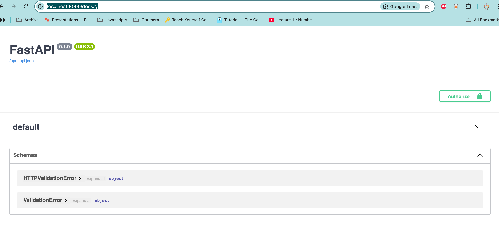
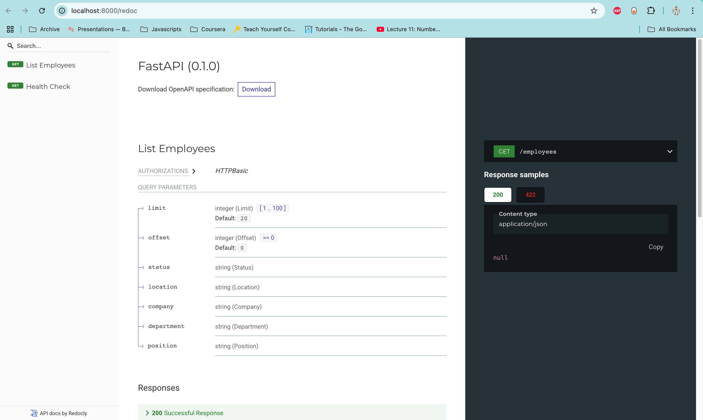

# Employee Search Service (fast-api)

[](https://github.com/quang-ng/employee-search-service/actions/workflows/ci.yml)


A simple, secure, and configurable employee directory microservice for HR organizations.

---

**CI/CD:** This project uses GitHub Actions to run tests and enforce a minimum code coverage of 80% on every push and pull request. The workflow is defined in `.github/workflows/ci.yml` and will fail if coverage drops below the threshold.

---

## Stack
- **Backend:** FastAPI (Python)
- **Database:** PostgreSQL
- **Caching:** Redis (for organization config and employee count)
- **Containerization:** Docker

## Features
- Organization-specific employee directory with configurable columns
- Secure, isolated data per organization
- RESTful API for employee search and listing
- Containerized for easy deployment

## Prometheus Metrics

This service exposes Prometheus-compatible metrics for monitoring and observability.

- **Metrics endpoint:** `GET /metrics`
- **Available metrics:**
  - `http_requests_total`: Total HTTP requests, labeled by method, endpoint, and status code
  - `http_request_latency_seconds`: Request latency histogram, labeled by method and endpoint

### Example: Scraping metrics

You can view metrics directly in your browser or with `curl`:

```bash
curl http://localhost:8000/metrics
```

To collect metrics with Prometheus, add a scrape config like:

```yaml
scrape_configs:
  - job_name: 'employee-search-service'
    static_configs:
      - targets: ['localhost:8000']
```

Metrics can be visualized in Prometheus, Grafana, or any compatible tool.

### Securing the /metrics endpoint

**Important:** By default, the `/metrics` endpoint is public. In production, you should restrict access to Prometheus only.

**Nginx example:**

```nginx
server {
    listen 80;
    server_name your-domain.com;

    location /metrics {
        allow 192.168.1.100;   # Prometheus server IP
        deny all;
        proxy_pass http://localhost:8000/metrics;
    }

    location / {
        proxy_pass http://localhost:8000;
    }
}
```

Replace `192.168.1.100` with your Prometheus server’s IP address. All other IPs will be denied access to `/metrics`.

## Caching with Redis

This service uses **Redis** for caching in two main scenarios:

- **Organization Configuration Cache:**
  - Organization-specific configuration data is cached in Redis to reduce database load and improve response times for repeated config lookups.

Redis caching helps ensure the service remains fast and scalable, especially under high load or with large organizations.

## Project Structure
```
employee-search-service/
├── app/
│   ├── api/                # API route handlers
│   ├── config/             # Organization-level config logic
│   ├── db/                 # Database models and access
│   ├── middleware/         # Auth, org isolation, etc.
│   ├── services/           # Business logic
│   └── main.py             # FastAPI entrypoint
├── Dockerfile              # Containerization
├── requirements.txt        # Python dependencies
├── README.md
├── pytest.ini             # Test configuration
├── run_tests.py           # Test runner script
└── tests/
    └── test_api_employees.py  # API unit tests
```
## Demo: Using the Employees API with `curl` and `jq`

You can interact with the Employee Search API using standard HTTP tools. The API now uses JWT-based authentication. Example users (all with password `testpass`) are seeded by default, e.g. `admin_techcorp`, `hr_manager`, etc. (all users info are in `init.sql`).

### Authenticate and Get a JWT Token

First, obtain a JWT token by logging in:

```bash
curl -X POST "http://localhost:8000/login" \
  -H "Content-Type: application/json" \
  -d '{"username": "admin_techcorp", "password": "testpass"}'
```

The response will look like:

```json
{
  "access_token": "<JWT_TOKEN>",
  "token_type": "bearer"
}
```

Save the `access_token` value for use in subsequent requests.

### List Employees (all, default pagination)

```bash
curl -H "Authorization: Bearer <JWT_TOKEN>" "http://localhost:8000/hr/1/employees/search" | jq
```

### Filter by Department

```bash
curl -H "Authorization: Bearer <JWT_TOKEN>" "http://localhost:8000/hr/1/employees/search?department=Engineering" | jq
```

### Paginate Results (Key-Set/Cursor Pagination)

```bash
# First page
curl -H "Authorization: Bearer <JWT_TOKEN>" "http://localhost:8000/hr/1/employees/search?limit=2" | jq

# Suppose the response contains "next_cursor": 2
# Fetch the next page using the next_cursor value
curl -H "Authorization: Bearer <JWT_TOKEN>" "http://localhost:8000/hr/1/employees/search?limit=2&cursor=2" | jq
```

### Show Only Employee Names

```bash
curl -H "Authorization: Bearer <JWT_TOKEN>" "http://localhost:8000/hr/1/employees/search" | jq '.results[].name'
```

### Example Response

```json
{
  "limit": 2,
  "cursor": null,
  "next_cursor": 2,
  "count": 10,
  "results": [
    {
      "id": 1,
      "name": "John Smith",
      "department": "Engineering",
      "position": "Senior Software Engineer",
      "location": "San Francisco",
      "contact_info": "john.smith@techcorp.com",
      "status": "active",
      "company": "TechCorp Inc.",
      "org_id": 1
    },
    {
      "id": 2,
      "name": "Jane Doe",
      "department": "Marketing",
      "position": "Marketing Manager",
      "location": "New York",
      "contact_info": "jane.doe@techcorp.com",
      "status": "active",
      "company": "TechCorp Inc.",
      "org_id": 1
    }
  ]
}
```

### Invalid org_id example

If you use an org_id that does not match your authenticated user's organization, you will receive a 404 error:

```bash
curl -u admin_techcorp:testpass "http://localhost:8000/hr/999/employees/search" | jq
```
Response:
```json
{
  "detail": "Organization not found"
}
```

### Invalid credentials example

```bash
curl -X POST "http://localhost:8000/login" \
  -H "Content-Type: application/json" \
  -d '{"username": "fakeuser", "password": "testpass"}'
```
Response:
```json
{
  "detail": "Invalid username or password"
}
```

### Rate Limit Error Example

If you make too many requests in a short period, the API will return a rate limit error (HTTP 429). You can simulate this by sending multiple requests quickly:

```bash
for i in {1..20}; do
  curl -H "Authorization: Bearer <JWT_TOKEN>" "http://localhost:8000/employees"
done
```

If the rate limit is exceeded, you will receive a response like:

```json
{
  "detail":"Rate limit exceeded. Please try again later"
}
```

You can also use `jq` to pretty-print the output and spot the error more easily:

```bash
for i in {1..20}; do
  curl -H "Authorization: Bearer <JWT_TOKEN>" "http://localhost:8000/employees" | jq
done
```

**Note:**  
- You must use a valid username/password (see the `init.sql` for seeded users).

---

## OpenAPI & API Documentation

This service provides a fully documented OpenAPI (Swagger) schema, which you can use to explore, share, or generate client SDKs for the API.

- **Swagger UI:**
  - Interactive docs at: [http://localhost:8000/docs](http://localhost:8000/docs)

  
- **ReDoc:**
  - Alternative docs at: [http://localhost:8000/redoc](http://localhost:8000/redoc)

  
- **Raw OpenAPI JSON:**
  - Download or share the OpenAPI schema at: [http://localhost:8000/openapi.json](http://localhost:8000/openapi.json)
  - Example:
    ```bash
    curl http://localhost:8000/openapi.json | jq
    ```
   - Sample response:
    ```json
      {
         "openapi": "3.1.0",
         "info": {
            "title": "FastAPI",
            "version": "0.1.0"
         },
         "paths": {
         ......
         }
      }
   ```
You can import the OpenAPI JSON into tools like Postman, Swagger Editor, or use it to generate client SDKs in various languages.

---

## Testing

The project includes comprehensive unit tests for the employee search API. The tests cover:

- **Authentication and authorization**
- **Employee listing with various filters**
- **Pagination functionality**
- **Organization configuration handling**
- **Error cases and edge conditions**

### Running Tests

1. **Install test dependencies:**
   ```bash
   pip install -r requirements.txt
   ```

2. **Run tests using pytest:**
   ```bash
   pytest tests/ -v
   ```

3. **Run tests using the test runner script:**
   ```bash
   python run_tests.py
   ```

4. **Run specific test file:**
   ```bash
   pytest tests/test_api_employees.py -v
   ```

### Test Coverage

The tests cover the following scenarios:

- ✅ Successful employee listing with default parameters
- ✅ Employee filtering by department, status, location, company, position
- ✅ Pagination with limit and cursor (key-set pagination)
- ✅ Organization not found error handling
- ✅ Empty result sets
- ✅ Limited field configuration
- ✅ Input validation (invalid limit/offset values)
- ✅ Unauthorized access handling

### Test Structure

- **TestListEmployees**: Unit tests for the `list_employees` function

---

## AI Tools & Best Practices

### What AI tools do our developers use?
- **Cursor with GPT-4.1 model of OpenAI**: For code completion, suggestions, and boilerplate generation.

### How do these tools assist?
- **Coding**: Suggest alternative implementations, and help generate repetitive code structures, speeding up development.
- **Debugging**: Developers use AI chat assistants to explain error messages, suggest fixes, and analyze stack traces.
- **Testing**: AI can help generate test cases, review test coverage, and suggest edge cases.
- **Documentation**: Tools like ChatGPT help me in drafting and refining documentation, README sections, and code comments.

### Best Practices for AI Tool Usage
- **Review All AI-Generated Code**: Always review, test, and understand code suggested by AI before merging.
- **Use AI for Ideation, Not as a Source of Truth**: Treat AI suggestions as starting points, not final answers.
- **Maintain Security & Privacy**: Never share sensitive code, credentials, or proprietary data with external AI tools.
- **Document AI-Assisted Changes**: Note in PRs or commit messages when significant code was generated or heavily influenced by AI.
- **Continuous Learning**: Stay updated on AI tool capabilities and limitations to maximize productivity and code quality. 